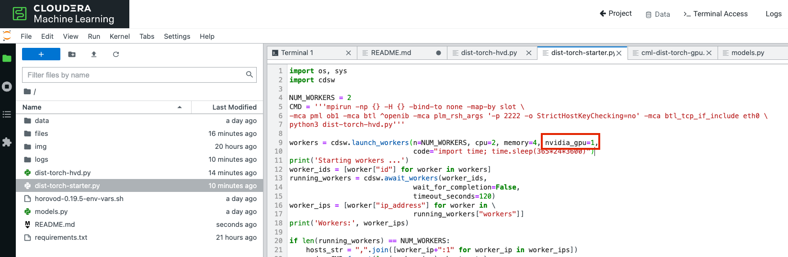
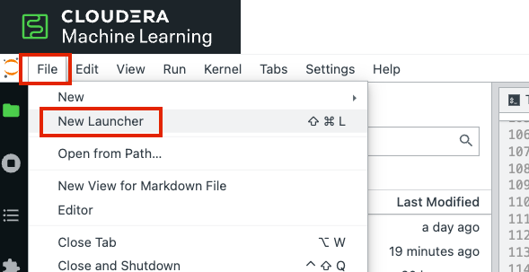
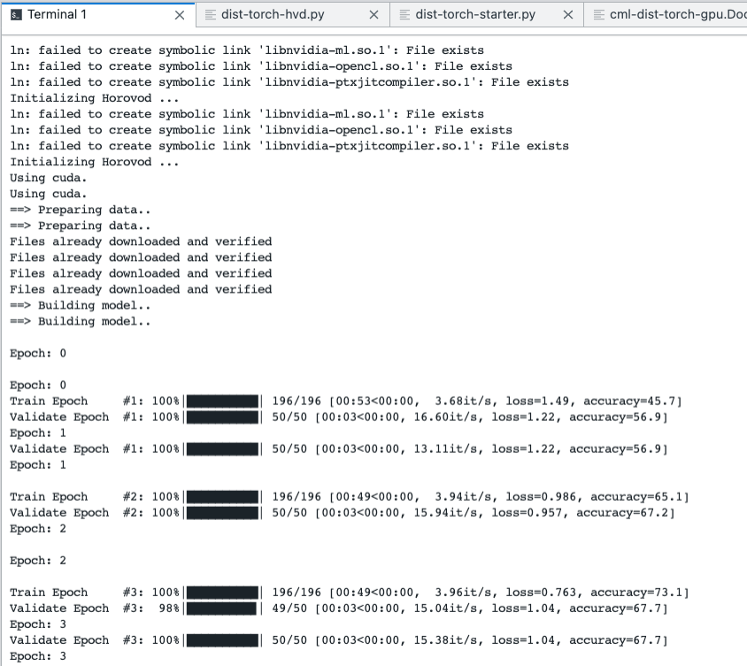

# Distributed PyTorch with Horovod

You can distribute training of ML algorithms with the Workers API. This tutorial shows how to train a simple Image Classifier in a distributed fashion.


### Prerequisites

This project is for CDSW and CML on both CDP Private and Public Cloud. 

Basic familiarity with Python, Deep Learning, CML and CDSW is recommended. 

However, you will not have to modify any of the code.  

If you are completely new to CDSW and CML, please reference [this tutorial](https://github.com/pdefusco/CML_CrashCourse) for the basics of creating a project, running a session, etc.


### Project Setup

#### Step 1: Add the Runtime

Navigate to the workspace Runtime Catalog page and click on "Add Runtime"


Add the runtime provided and click on "Validate"

```
zelkey/cml-dist-torch:1.0-cuda11.1
```


Validate that the runtime as appeared in the list. 

#### Step 2: Create the Project

Next, navigate to the Projects page and click on "New Project"

In the first section of the page, enter a Project Name. 

In the "Initial Setup" section, make sure to select the "Git" option and enter the following URL:

```
https://github.com/pdefusco/Distributed_PyTorch_Horovod.git
```


Then, scroll down to the Runtime Setup section. Select "Advanced" and then pick the following from each dropdown:

```
Editor: JupyterLab
Kernel: Python 3.8
Edition: Distributed PyTorch
```


Notice this is the runtime you added to the catalog earlier. You are now basing the project on this runtime.

Finally, click on "Add Runtime". Validate that it was loaded and click on "Create Project"


#### Step 3: Install Requirements

Because you based your project off the runtime, your dependencies are already available. However, you need to install the tqdm package.

To do so, open a Session by clicking on "New Session" from the project home folder.


Use the following settings to launch the session:

```
Session Name: Optional
Resource Profile: 2 vCPU / 4 GiB Memory or more is recommended but not mandatory
```


Next, open the terminal and enter the following command into the prompt:

```
pip3 install -r requirements.txt
```


Congratulations! You are now ready to train your Image Classifier.


### Distributed Training

#### Step 1: Distributed Training with CPUs

In the same Session, open a terminal from the JupyterLab Launcher


Next, run the training session by issuing the following command in the prompt:

```
python dist-torch-starter.py
```

After a few moments, you should start noticing the output of each epoch. 


However, if you are using the session you used to install your requirements, you will notice that this is going a little slow. 

Time to use GPUs! Interrupt the distributed training process by entering "Ctrl" + "C" on your keyboard.

#### Step 2: Distributed Training with GPUs

Start a new session and this time select 1 GPU:

```
Session Name: Optional
Resource Profile: 2 vCPU / 4 GiB Memory or more and 1 GPU
```

Next, open the "dist-torch-starter.py" file in Jupuyter Lab.

At line 9 change the value of the "nvidia_gpu" argument from 0 to 1 as shown below.



Go back to the Jupyter Lab launcher as you did before and open a "terminal" window

Tip: if you've lost the "Launcher" tab you can reopen it by going to "File" on the top left of your screen.



Next, rerun the training session by issuing the following command in the prompt:

```
python dist-torch-starter.py
```

Shortly after you should notice the same output as in your previous attempt when using CPUs, with the exception that model training should happen a lot faster.



Let the model training continue. With the predefined settings this should take a few minutes, but you can always increase the number of GPUs or nodes in "dist-torch-starter.py" or even modify network architecture in "models.py". Of course, please be careful because GPUs are more expensive.

#### Step 3: Spinning Down Workers

Now that your model has finished training, don't forget to spin down your workers! 

The fastest way to do so is to execute the "stop_workers.py" script from the terminal:

```
python kill_workers.py
```


### How to build the Docker image with CUDA (Optional)

If you want to build the runtime yourself you can reuse the docker file examples in the files folder. 

You can build the images with the following commands.

docker build --network host -t zelkey/cml-dist-openmpi:1.0-cuda11.1 . -f cml-dist-cuda111.Dockerfile
docker run --network host -it zelkey/cml-dist-openmpi:1.0-cuda11.1 /bin/bash

docker build --network host -t zelkey/cml-dist-torch:1.0-cuda11.1 . -f cml-dist-torch-gpu.Dockerfile
docker run --network host -it zelkey/cml-dist-torch:1.0-cuda11.1 /bin/bash


## Conclusion

You have completed the tutorial. In summary:

* PyTorch is one of the most popular frameworks for Deep Learning with Python.
* Horovod is one of the most popular frameworks for distributing Deep Learning workloads.
* The Workers API in CDSW and CML allows you to quickly spin up new pods and provisioning the infrastructure required by Horovod.
* In this tutorial you tested an image classifier but Deep Learning can be applied to numerous other use cases related to Video, Audio, Speech, Text and of course even structured datasets.

## Related Demos and Tutorials

If you are evaluating CDSW or CML you may also benefit from testing the following demos:

* [Telco Churn Demo](https://github.com/pdefusco/CML_AMP_Churn_Prediction): Build an End to End ML Project in CML and Increase ML Explainability with the LIME Library
* [Learn how to use Cloudera Applied ML Prototypes](https://docs.cloudera.com/machine-learning/cloud/applied-ml-prototypes/topics/ml-amps-overview.html) to discover more projects using MLFlow, Streamlit, Tensorflow, PyTorch and many more popular libraries
* [CSA2CML](https://github.com/pdefusco/CSA2CML): Build a real time anomaly detection dashboard with Flink, CML, and Streamlit
* [SDX2CDE](https://github.com/pdefusco/SDX2CDE): Explore ML Governance and Security features in SDX to increase legal compliance and enhance ML Ops best practices 
* [API v2](https://github.com/pdefusco/CML_AMP_APIv2): Familiarize yourself with API v2, CML's goto Python Library for ML Ops and DevOps
* [MLOps](https://github.com/pdefusco/MLOps): Explore a detailed ML Ops pipeline powered by Apache Iceberg

## Credits

[Zuling Kang](https://www.linkedin.com/in/zuling-kang-16122831/), Senior Machine Learning Solutions Architect at Cloudera, designed and created this tutorial. 

Zuling has been an active contributor in the Cloudera ecosystem for more than five years. He brings expertise in big data platform & architecture, stream computing, performance tuning of distributed systems, and machine learning. He is a customer facing architect and data scientist, specializing in communication, financial services, manufacture industries with wide ranges of specialties in big data systems and machine learning. 

Zuling also has broad research interests in big data related technologies, including cloud architectures, machine learning, data-level integration of traditional IT systems with big data platforms, etc. His recent paper ‘Performance-Aware Cloud Resource Allocation via Fitness-Enabled Auction’ was published in IEEE transactions on Parallel and Distributed Systems, which is fully indexed by SCI and ESI (Essential Science Indicators).

