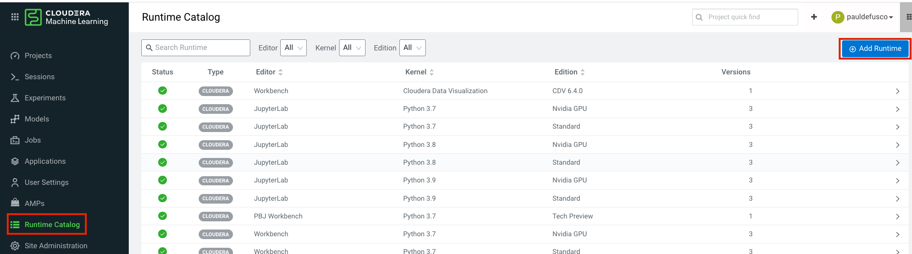
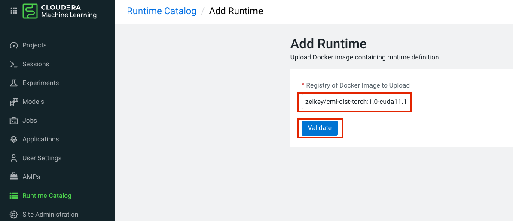
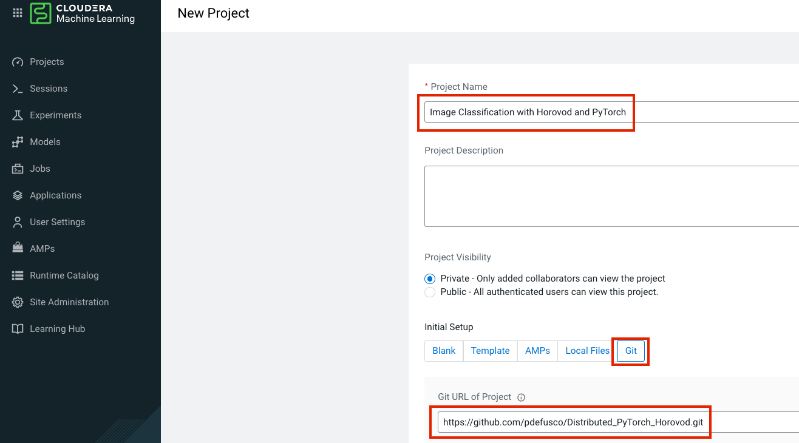
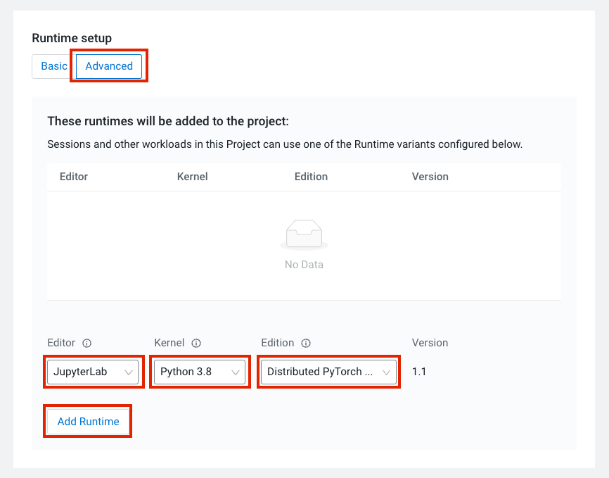
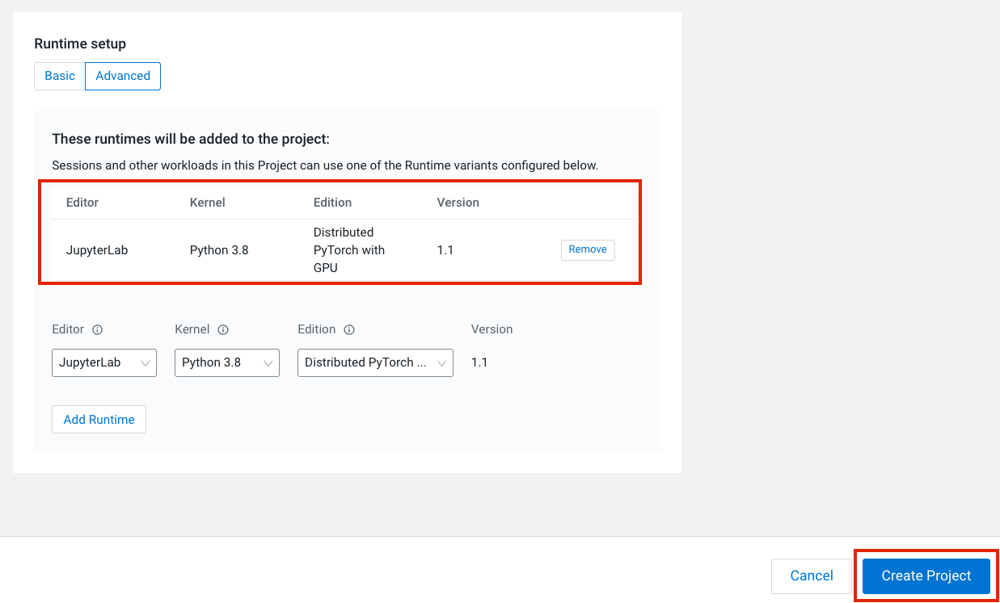
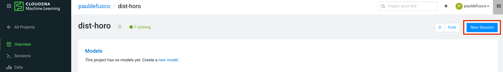
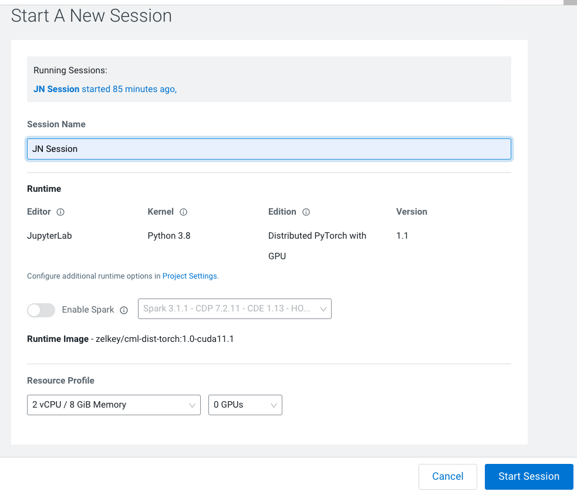
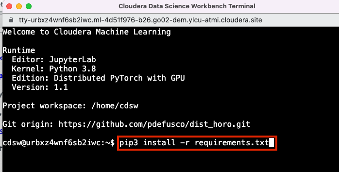
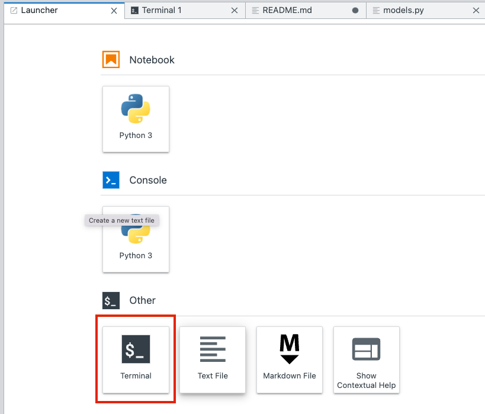
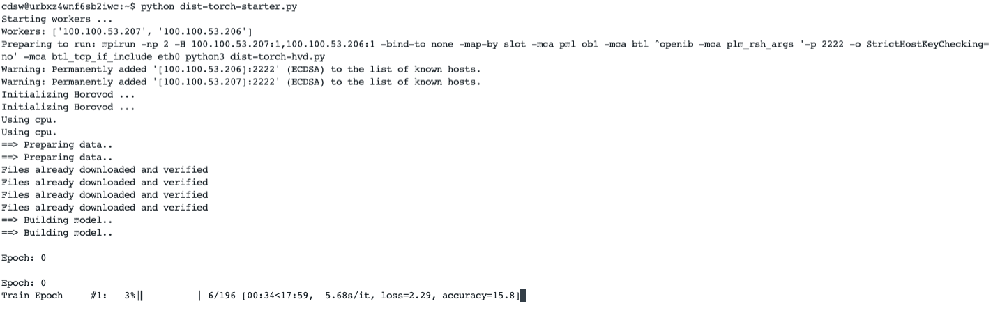

# Distributed PyTorch with Horovod

You can distribute training of ML algorithms with the Workers API. This tutorial shows how to train a simple Image Classifier in a distributed fashion.


### Prerequisites

This project is for CDSW and CML on both CDP Private and Public Cloud. 

Basic familiarity with Python, Deep Learning, CML and CDSW is recommended. 

However, you will not have to modify any of the code.  

If you are completely new to CDSW and CML, please reference [this tutorial](https://github.com/pdefusco/CML_CrashCourse) for the basics of creating a project, running a session, etc.


### Project Setup

#### Step 1: Add the Runtime

Navigate to the workspace Runtime Catalog page and click on "Add Runtime"



Add the runtime provided and click on "Validate"

```
zelkey/cml-dist-torch:1.0-cuda11.1
```



Validate that the runtime as appeared in the list. 

#### Step 2: Create the Project

Next, navigate to the Projects page and click on "New Project"

In the first section of the page, enter a Project Name. 

In the "Initial Setup" section, make sure to select the "Git" option and enter the following URL:

```
https://github.com/pdefusco/Distributed_PyTorch_Horovod.git
```


Then, scroll down to the Runtime Setup section. Select "Advanced" and then pick the following from each dropdown:

```
Editor: JupyterLab
Kernel: Python 3.8
Edition: Distributed PyTorch
```



Notice this is the runtime you added to the catalog earlier. You are now basing the project on this runtime.

Finally, click on "Add Runtime". Validate that it was loaded and click on "Create Project"



#### Step 3: Install Requirements

Because you based your project off the runtime, your dependencies are already available. However, you need to install the tqdm package.

To do so, open a Session by clicking on "New Session" from the project home folder.



Use the following settings to launch the session:

```
Session Name: Optional
Resource Profile: 2 vCPU / 4 GiB Memory or more is recommended but not mandatory
```



Next, open the terminal and enter the following command into the prompt:

```
pip3 install -r requirements.txt
```



Congratulations! You are now ready to train your Image Classifier.


### Distributed Training

#### Step 1: Distributed Training with CPUs

In the same Session, open a terminal from the JupyterLab Launcher



Next, run the training session by issuing the following command in the prompt:

```
python dist-torch-starter.py
```

After a few moments, you should start noticing the output of each epoch. 



However, if you are using the session you used to install your requirements, you will notice that this is going a little slow. 

Time to use GPUs! Interrupt the distributed training process by entering "Ctrl" + "C" on your keyboard.

#### Step 2: Distributed Training with GPUs


# How to build the Docker image with CUDA

If you want to build the image yourself, you can find the docker file examples in the files folder. 

You can build the images with the following commands.

docker build --network host -t zelkey/cml-dist-openmpi:1.0-cuda11.1 . -f cml-dist-cuda111.Dockerfile
docker run --network host -it zelkey/cml-dist-openmpi:1.0-cuda11.1 /bin/bash

docker build --network host -t zelkey/cml-dist-torch:1.0-cuda11.1 . -f cml-dist-torch-gpu.Dockerfile
docker run --network host -it zelkey/cml-dist-torch:1.0-cuda11.1 /bin/bash
